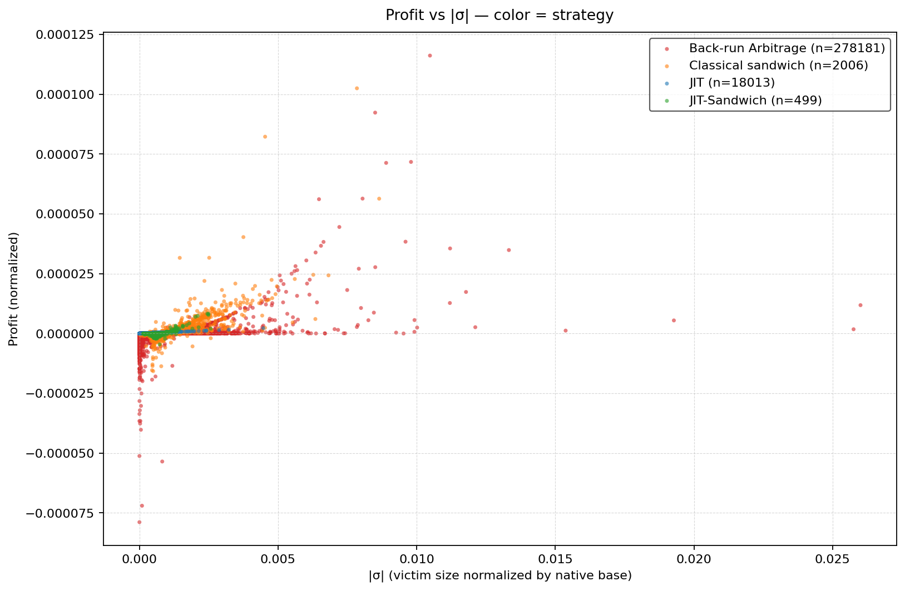
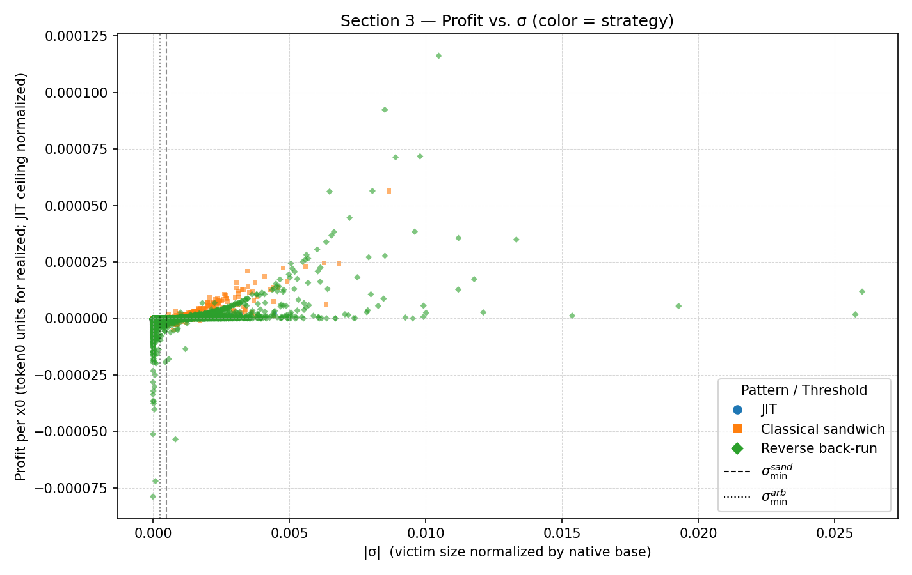

# MEV_analysis — Uniswap v3 MEV detection + “Section 3” theory augmentation

This repository implements a workflow to (i) **collect Uniswap v3 pool events** (Swap/Mint/Burn), (ii) **detect strict, same-block MEV patterns** on a single pool, and (iii) **augment those detected patterns with theoretical quantities** (normalized sizes, price impact, feasibility thresholds, profit ceilings) used throughout the repo’s “Section 3” analysis.

The empirical outputs (generated locally) live in `mev_out/` and are mirrored (in curated form) under `docs/assets/` for GitHub Pages.

## Scientific goal / research question

Given a single Uniswap v3 pool event stream, the core questions are:

1. How frequently do **Pure JIT liquidity cycles**, **(JIT-)sandwiches**, and **reverse back-run arbitrages** appear under a *strict within-block adjacency* definition?
2. For those detected events, how do **observed outcomes** compare to the repo’s **theory-side bounds/optima** as functions of normalized trade size and slippage constraints?

## Model overview (notation used in code)

This repo uses a v2-like “virtual reserve” representation of Uniswap v3 around the active tick:

- Let `L` be active liquidity and `√P` the pool’s current square-root price.
- Convert the on-chain `sqrtPriceX96` to a float and use:

  $$
  x = \frac{L}{\sqrt{P}},\quad y = L\sqrt{P}
  $$

This allows expressing trade sizes in a normalized way (the repo writes multiple variants; the main “size” variable used in plots is `sigma_gross`):

- `f` = pool fee fraction (e.g., 5 bps → `f = 0.0005`)
- `r = 1 - f` (effective post-fee factor used in formulas)
- `σ` (“sigma”) = normalized victim trade size (gross), direction-aware
- `ε` (“epsilon”) = normalized attacker trade size (gross), direction-aware
- `γ` (“gamma”) = victim slippage tolerance used in theory constraints (a modeling choice; optionally measurable via calldata decoding)

The code encodes direction-specific **price impact** functions (see `scripts/mev_collect.py`):

- For `x → y` swaps:
  $$
  I_{x\to y}(\sigma) = \frac{1}{(1 + r\sigma)^2} - 1
  $$
- For `y → x` swaps:
  $$
  I_{y\to x}(\sigma) = (1 + r\sigma)^2 - 1
  $$

Two core feasibility/constraint ingredients used throughout:

- **Back-run viability threshold** (implemented as `backrun_sigma_min(r)`):
  $$
  \sigma_{\min} = \frac{\tfrac{1}{\sqrt{r}} - 1}{r}
  $$

- **Max attacker size under a slippage guard** (implemented as `eps_max_under_slippage(σ, γ, r)`):
  $$
  \varepsilon_{\max}(\sigma,\gamma,r) =
  \frac{\left(\frac{-r\sigma + \sqrt{(r\sigma)^2 + \frac{4(1+r\sigma)}{1-\gamma}}}{2} - 1\right)}{r}
  $$

For the repo’s **JIT-sandwich** bundle, the constraint uses an “attacker liquidity share” parameter `α` (computed as `attacker_liq_share` in outputs) and implements the repo’s documented variant:

$$
\varepsilon_{\max}(\sigma,\gamma,r,\alpha) =
\frac{\left(\frac{-r\sigma + \sqrt{(r\sigma)^2 + \frac{4(1+\alpha)^2(1+r\sigma)}{1-\gamma}}}{2(1+\alpha)} - 1\right)}{r}
$$

## Algorithm / detection protocol

### 1) Data collection: pool event harvesting

`scripts/data_fetch.py` fetches `Swap`, `Mint`, and `Burn` logs for a single Uniswap v3 pool over a time range and writes a per-event CSV. It also derives “running state” columns such as `L_before` and `sqrt_before` by walking the event stream in strict `(blockNumber, logIndex)` order.

The script uses a **subgraph-first** strategy:

- The Uniswap v3 subgraph provides the canonical event stream (including `origin`, amounts, ticks, sqrtPriceX96).
- RPC calls (`eth_getLogs`) are used **only** for `Swap.liquidity` (active liquidity after each swap), which the subgraph does not reliably expose. These calls go through a quarantine-aware RPC client (`scripts/quarantined_rpc.py`) that respects `Retry-After` on HTTP 429 and rotates endpoints.
- Gas fields (`gasUsed`, `gasPrice`, `effectiveGasPrice`) are **left empty** by default; enrich later with `scripts/add_gas.py`.

Optional / post-processing enrichments:

- `scripts/add_origin.py`: backfill `origin` for an existing CSV (e.g., external dataset)
- `scripts/add_gas.py`: backfill `gasUsed`, `gasPrice`, `effectiveGasPrice` for an existing CSV
- `scripts/fetch_slippage_from_tx.py`: decodes swap calldata and quotes pre-trade expectations (QuoterV2 at `block-1`) to estimate implied slippage tolerance

### 2) MEV pattern detection (single pool, strict adjacency)

`scripts/mev_collect.py` detects patterns **within a single pool and within a single block**, requiring “anchor” events to be *contiguous* in `(blockNumber, logIndex)` order:

- **Pure JIT**: `Mint(att) → victim swap(s) (≠att) → Burn(att)`
- **Classical sandwich**: `front swap(att) → victim swap(s) (dir D, ≠att) → back swap(att, dir ¬D)`
- **JIT-sandwich**: `front → mint → victim swap(s) → burn → back`
- **Reverse back-run**: `victim swap by A` immediately followed by `swap by B` in the opposite direction

For each detected row/cycle, the script computes and stores:

- pool pre-state (`L0, sqrtP0, x0, y0`) and trade direction
- normalized sizes (`sigma_*`, `eps_*`)
- measured vs theoretical price impact (`I_measured`, `I_theory`)
- realized profits (where available) and theory-side optima/bounds (e.g., `br_pi_star_*`, `sand_pi_star_*`, `eps_max_*`)

Parallelism: the detector chunk-splits blocks and uses a `ProcessPoolExecutor` (`--n-jobs`, `--chunk-size`) for CPU-bound scanning.

### 3) Input dataset requirements (for `scripts/mev_collect.py`)

`scripts/mev_collect.py` is designed to run on the CSV produced by `scripts/data_fetch.py`. At minimum, pattern detection relies on:

- `eventType` (or `event`)
- `blockNumber`, `logIndex` (strict in-block ordering)
- `transactionHash`
- `amount0`, `amount1` (Uniswap v3 swap semantics: **pool deltas**; `amount0>0, amount1<0` implies `x→y`, and vice-versa)
- `origin` (tx sender; required to distinguish attacker vs victim)

To compute normalized sizes (`sigma_gross`, etc.) and theory-side metrics, you also need running-state columns:

- `L_before`
- `sqrt_before` (or `sqrtPriceX96_before`)

Notes:

- If you start from an external event CSV, you must have `origin` and running-state (`L_before`/`sqrt_before`) fields; otherwise the detectors may find zero patterns and/or produce `NaN` theory fields. If needed, use `scripts/add_origin.py` (and ensure running state is computed).
- Because blocks are scanned in parallel, **output row order is not guaranteed**. Sort the tidy outputs downstream if you need stable ordering.

## Repository entry points

The repo is script-first (not a packaged library). The main entry points:

- `scripts/data_fetch.py`: fetch pool events + running state (subgraph-first; RPC only for swap liquidity; gas fields left empty) to CSV (writes under `data/`)
- `scripts/add_origin.py`, `scripts/add_gas.py`: backfill those metadata fields for an existing CSV (writes under `data/`)
- `scripts/mev_collect.py`: detect patterns + compute theory fields; writes “tidy” CSVs to `mev_out/`
- `scripts/section3_empirical_simple.py`: Plotly scatter of profit vs `|σ|` by strategy
- `scripts/section3_empirical.py`: Plotly scatter with origin coloring / highlighting
- `notebooks/mev_profit_analysis.ipynb`: theory/plots (strategy comparison, regime transitions, etc.)

## How to run (reproducibility notes)

Assumption: you have a working Python environment with the scientific stack and Ethereum RPC access. The repo’s scripts mention using a conda env named `main`:

```bash
conda activate main
```

### 1) Fetch a pool dataset (requires subgraph + RPC access)

`scripts/data_fetch.py` reads configuration from environment variables and CLI flags. The subgraph endpoint is set via `UNIV3_GRAPH_URL` (or `--graph-url`); RPC endpoints are read from `MEV_RPC_URLS` (preferred; space-separated) or `WEB3_PROVIDER_URI` (single endpoint). After setting those:

```bash
export UNIV3_GRAPH_URL="https://gateway.thegraph.com/api/<KEY>/subgraphs/id/..."
export MEV_RPC_URLS="https://<RPC_1> https://<RPC_2>"
python scripts/data_fetch.py
```

This writes a CSV like `data/raw/univ3_<POOL_ADDR>.csv` and a resume checkpoint under `data/checkpoints/`. Re-running the same command resumes from where it left off via the checkpoint.

### 2) Optional: add origin / gas

Note: `scripts/data_fetch.py` writes `origin` (from the subgraph) but leaves gas fields empty. Use `scripts/add_gas.py` to backfill gas data, and `scripts/add_origin.py` only if enriching an external CSV that lacks `origin`.

Both `scripts/add_origin.py` and `scripts/add_gas.py` support incremental resume via checkpoints. Defaults are repo-relative; use CLI flags to override.

### 3) Detect patterns and write tidy outputs

```bash
python scripts/mev_collect.py --in data/raw/univ3_<POOL_ADDR>.csv --outdir ./mev_out --fee_bps 5 --gamma 0.01 --n-jobs -1
```

By default (fee tier = 5 bps), this writes:

- `mev_out/jit_cycles_tidy_5.csv`
- `mev_out/sandwich_attacks_tidy_5.csv`
- `mev_out/reverse_backruns_tidy_5.csv`

If you pass `--fee-bps` as a fraction (e.g., `0.0005`), it is normalized to basis points for formulas and output naming (so `0.0005` still writes `*_5.csv`).

Note: if you want to force recomputation, pass `--recompute_jit --recompute_sand --recompute_br`.

### 4) Make the core plot(s)

```bash
python scripts/section3_empirical_simple.py \
  --in-jit ./mev_out/jit_cycles_tidy_5.csv \
  --in-sand ./mev_out/sandwich_attacks_tidy_5.csv \
  --in-backrun ./mev_out/reverse_backruns_tidy_5.csv \
  --out ./mev_out/section3_scatter_by_strategy.html
```

Legacy note: some older runs in this repo use unsuffixed files (`*_tidy.csv`). The plotting scripts also attempt backward-compatible path discovery.

## Outputs and results (curated snapshot)

### Profit vs |σ| (by strategy)



Interactive version (small HTML snapshot):
- `assets/html/section3_scatter_by_strategy_30.0.html`

### Profit vs |σ| (origin-aware view)



### Summary metrics from the tracked tidy CSVs

The table below is generated from `mev_out/*.csv` via `docs/scripts/build_report_assets.py`:

| Dataset | Rows | Unique origins | σ p50 | σ p90 | Profit p50 | Profit p90 |
|---|---:|---:|---:|---:|---:|---:|
| JIT cycles | 18013 | 88 | 0.000123687 | 0.000481352 | 5.99699e-08 | 2.46908e-07 |
| Sandwich attacks | 2505 | 51 | 0.000750591 | 0.00182098 | -6.44749e-08 | 2.96431e-06 |
| Reverse back-runs | 278181 | 120045 | 5.3097e-06 | 0.000198035 | -1.72154e-09 | -7.60752e-11 |

Full CSV outputs:
- `assets/tables/summary_metrics.csv`
- `assets/tables/top_origins.csv`

### Theory-side plots from the notebook (PDFs)

- Strategy comparison: `assets/figures/profits_comparison.pdf`
- Regime transition panels: `assets/figures/regime_transition_subplots.pdf`
- ε-max constraints: `assets/figures/epsilon_max_sand.pdf`, `assets/figures/epsilon_max_jit_sand.pdf`
- Back-run prediction checks: `assets/figures/obs_vs_pred_backrun.pdf`, `assets/figures/abs_vs_pred_backrun.pdf`

## Validation and diagnostics hooks

- `scripts/sand_jit_fr_vs_br.py` tests an internal identity relating front-run, back-run, and the JIT liquidity share parameter `α`.

## Limitations and known issues

- **Strict detection definition**: patterns are same-block and contiguous in log order on a single pool. This deliberately misses multi-block and cross-pool MEV.
- **Uniswap v3 approximations**: the “virtual reserve” mapping is local to the active tick and does not model full-range/tick-crossing complexities.
- **Environment + RPC**: fetching/decoding requires RPC access; bundled endpoints/keys in scripts should be treated as placeholders.
- **Hard-coded paths**: scripts assume repo-relative `data/` + `mev_out/` defaults; override via CLI when needed.

## References

- Companion paper snapshot (derivations + additional figures): `assets/paper/mev_corrected.pdf`
- TODO: add explicit external references for Uniswap v3 math/periphery and the “Section 3” derivations (currently encoded directly in `scripts/mev_collect.py`).
